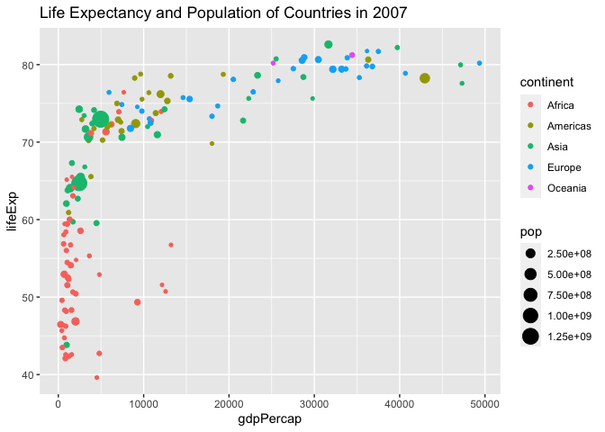

Population and Life Expectancy by Country in 2007
================


## Packages and Data wrangling

``` r
library(ggplot2)
```

    ## Warning: package 'ggplot2' was built under R version 4.0.2

``` r
library(dplyr)
```

    ## Warning: package 'dplyr' was built under R version 4.0.2

    ## 
    ## Attaching package: 'dplyr'

    ## The following objects are masked from 'package:stats':
    ## 
    ##     filter, lag

    ## The following objects are masked from 'package:base':
    ## 
    ##     intersect, setdiff, setequal, union

``` r
library(gapminder)
```

    ## Warning: package 'gapminder' was built under R version 4.0.2

``` r
gapminder_2007 <- gapminder %>% 
  filter(year == 2007)
```

## Plot

<!-- -->

[How many people are in the
world?](https://www.worldometers.info/world-population/)
